# Level and Crop
Blender add-on estimates and recommends image tilt and cropped dimensions. Example titled image:

After tilt correction:

The add-on optimizes how much image is kept, so your image's original aspect ratio may be lost.

# Installation
Before installing, ensure you have the Python libraries and version listed in the `requirements.txt` file. You can either download this repository as a zip folder or clone it with Git. If you downloaded the zip folder, you will need to unzip it.

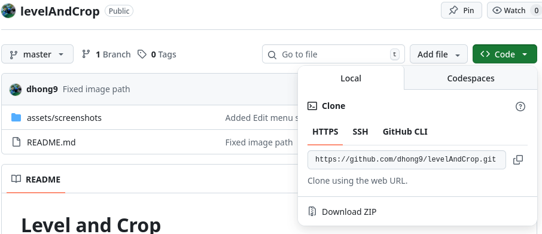

To add the extension in Blender, first navigate to Edit/Preferences.

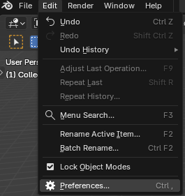

From the Preferences left sidebar, select "Add-ons." Then, open the dropdown menu in the top left corner and select "Install from Disk..."

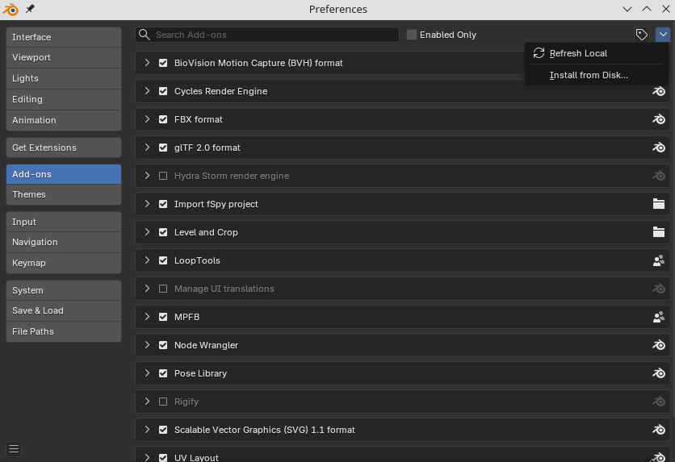

From the file dialog prompt, navigate to and select `levelAndCrop/level_and_crop.py`. You will then see that the add-on is automatically selected.

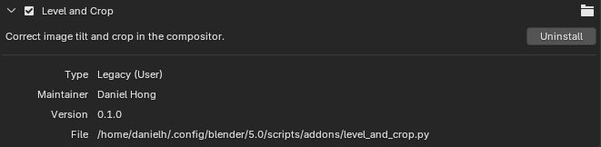

# Usage
The "Level and Crop" panel is in the compositor.

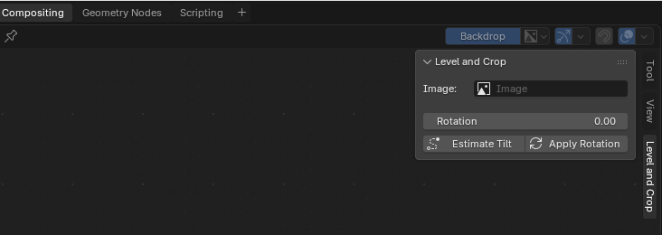

From there, you will see the following fields:
* Image - the image to work on
* Rotation - how much the image should be rotated by in degrees
* Estimate Tilt - have the add-on estimate the image tilt
* Apply Rotation - Calculate the new render dimension after rotation the image

## Loading an Image
To load an image, first make a new node tree in the compositor.

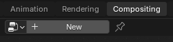

Replace the Render node with an Image node.

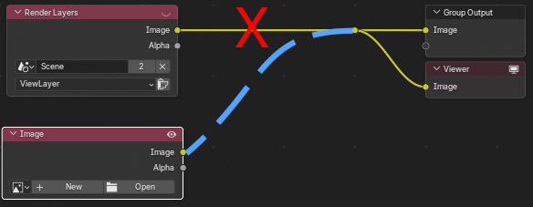

With the new Image node, you can use its Open button to load one of your images. Your selected image will also appear in the backdrop as a preview.

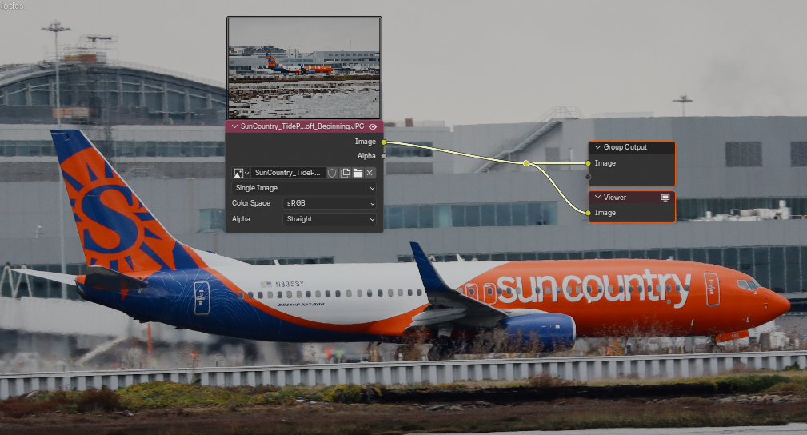

## Remaining Workspace Setup
Keyboard shortcuts for adjusting preview image zoom:
* `V` to zoom out
* `Alt` + `V` to zoom in

So that your original image color quality is preserved, navigate on the right side widget to Render/Color Management/View and change the view to Standard.

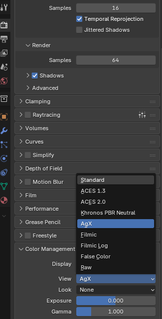

In the Output tab, you can configure resolution, default output folder, image extension, and compression.

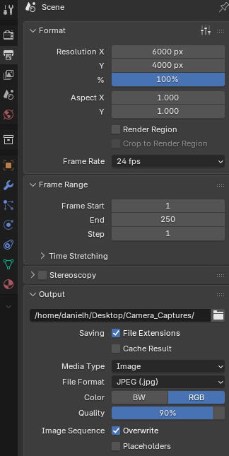

## Picking an Image
From the Level and Crop panel, the Image dropdown lists images that you have loaded. From there, you select what image you want to work on.

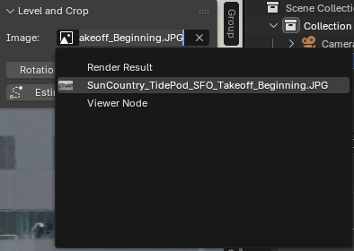

## Adjusting Rotation

To rotate your image, add a Transform node and input a rotation value in there. Positive values rotate the image __counterclockwise__.

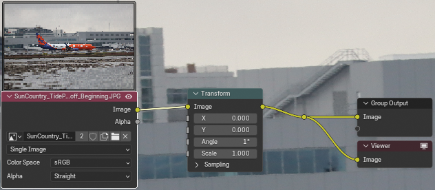

To get your new render dimensions after adjustment, input that same rotation value into the Level and Crop widget's Rotation field.

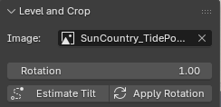

The add-on will inform you at the bottom of your window that the new image dimension has been computed.

You can also see those values updated in the Render tab.

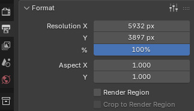

## Estimating Tilt

You can use the add-on's "Estimate Tilt" button to estimate how much your image should be rotated by to be considered level. When doing so, the add-on will inform you how much your image is tilted by.

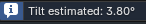

That value will also be copied to the Level and Crop widget.

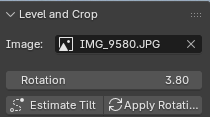

Note that the cropped image dimension is not used until you hit "Apply Rotation." If the rotation does not level your image, you can overwrite that value in the Level and Crop widget.